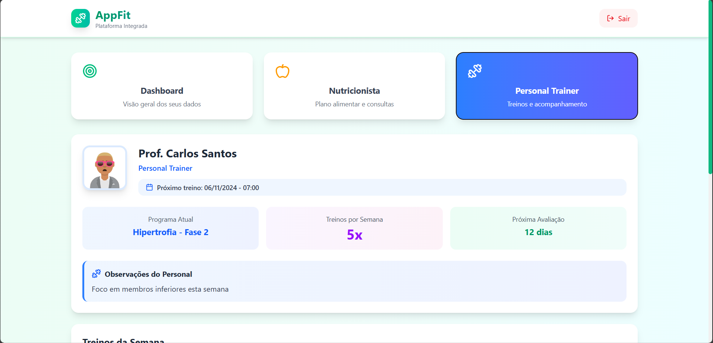

<h1 align="center"> AppFit </h1>

  <a href="#-tecnologias">Tecnologias</a>&nbsp;&nbsp;&nbsp;|&nbsp;&nbsp;&nbsp;
  <a href="#-projeto">Projeto</a>&nbsp;&nbsp;&nbsp;|&nbsp;&nbsp;&nbsp;

  

 

## 🚀 Tecnologias

Esse projeto foi desenvolvido com as seguintes tecnologias:

- Tailwind CSS
- React
- Git e Github
- TypeScript

## 💻 Projeto

O AppFit é um sistema que unifica acesso de profissionais da saude e usuario final em pro de um objetivo sendo ele com atividades fisicas ou alimentação.

---

Desenvolvido por </ Mateus Borges />